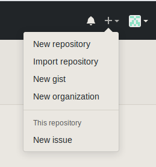
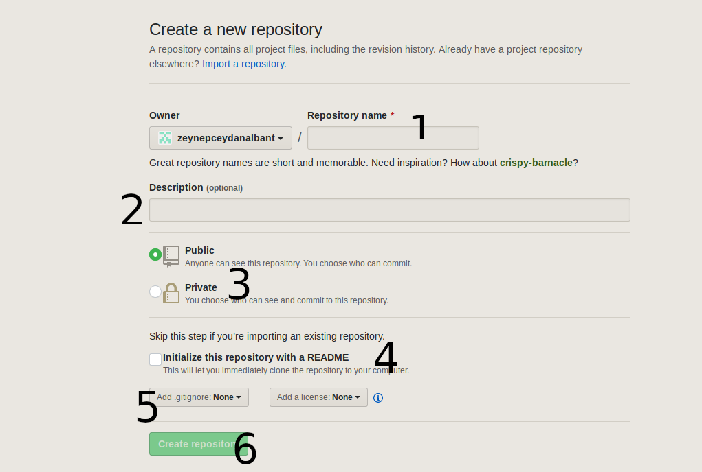

# İkinci Gün 21.07.2019

## New Repository(Yeni Depo) Nasıl Oluşturulur?
Profilinizin sağ üst köşesindeki "+" işaretine tıklayınız.


<br>

Karşınıza bu sayfa çıkacaktır.



1- Deponuza bir isim veriniz.

2- Açıklama giriniz.

3-Eğer girdilerinizi herkesin görmesini istiyorsanız public seçeneğini, eğer size özel kalmasını istiyorsanız private seçeneğini seçiniz.(Seçimizi daha sonra değiştirebilirsiniz.)

4- Mevcut bir havuzunuz yoksa depoya konulacak şeyler hazır değilse bu seçeneği seçip depoyu README adlı dosya ile başlatabilirsiniz.

5- Lisans ile alakalı seçimler

6-Deponuzu oluşturunuz.
## Commit Nedir?
Bilgisayar bilimi ve veri yönetiminde, bir taahhüt kalıcı bir dizi geçici değişiklik yapmaktır. Popüler bir kullanım bir işlemin sonundadır. Bir taahhüt bir taahhüt hareketidir.
## Markdown komuları
[Buradan ulaşabilirsiniz.](http://alikatircio.com/markdown-editor/)
## Githistory Nedir?
Birkaç kayıt oluşturduktan, ya da halihazırda kayıt tarihçesi olan bir yazılım havuzunu klonladığınızda, muhtemelen geçmişe bakıp neler olduğuna göz atmak için kullanabileceğiniz bir sitedir.

[githistory.xyz](https://githistory.xyz/) sayfasına giriş yapıp, projenizde "github.com" kısmını silerek githistory.xyz yazarak kullanabilisiniz.

## Localhost Kurulum Hataları Giderme
### Access denied for user 'root'@'localhost' Uyarısını Kaldırmak

  ```sudo mysql -u rootshow databases;
  use mysql;
  update user set plugin='' where User='root';
  flush privileges;
  exit;
  ```
  ## Eksik Dosya Hatası
  ```  
sudo apt purge apache2;
sudo apt purge mariadb*;
sudo apt purge php*;
  ```
  bunlar ile tamamen kaldırıp tekrar kurulum yapmalısınız.
## MySQL Veritipleri Nelerdir?
### Metin alanları

**CHAR ()** 0 ile 255 karakter arası değer verebiliriz.  
**VARCHAR ()** 0 ile 255 karakter arası değer verebiliriz.  
**TINYTEXT** en fazla 255 karakter  
**TEXT** en fazla 65535 karakter  
**MEDIUMTEXT** en fazla 16777215 karakter  
**MEDIUMBLOB** en fazla 16777215 karakter  
**LONGTEXT** en fazla 4294967295 karakter

### Sayısal Alanlar

**TINYINT ()** -128 ile 127 arası normal ( 0 ile 255 arası UNSIGNED)  
**SMALLINT ()** -32768 ile 32767 arası normal (0 ile 65535 arası UNSIGNED)  
**MEDIUMINT ()** -8388608 ile 8388607 arası normal (0 ile 16777215 arası UNSIGNED)  
**INT ()** -2147483648 ile 2147483647 arası normal (0 ile 4294967295 arası UNSIGNED)  
**BIGINT ()** -9223372036854775808 ile 9223372036854775807 arası normal (0 ile 18446744073709551615 arası UNSIGNED)  
**FLOAT** virgüllü sayı  
**DOUBLE** (,) virgüllü büyük sayı  
**DECIMAL** (,) string olarak virgüllü sayı

### Zaman Alanları

**DATE** YYYY-MM-DD  
**DATETIME** YYYY-MM-DD HH:MM:SS  
**TIMESTAMP** YYYYMMDDHHMMSS  
**TIME** HH:MM:SS
